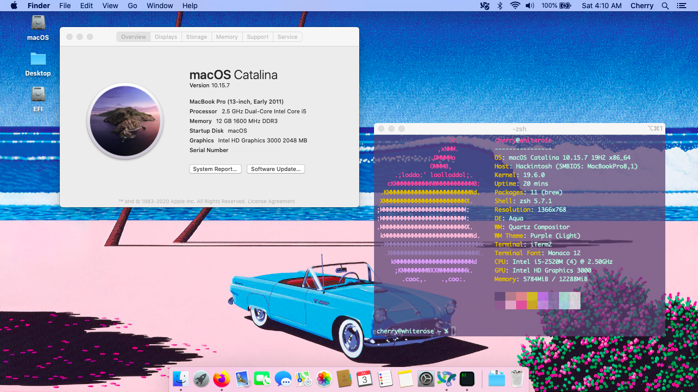

# Lain's X220 macOS Catalina Repository
### UPDATE: As of August 1st, 2021, I've rolled my personal X220T back to macOS Mojave due to needing 32-bit support for older audio hardware and applications. I won't be able to provide any support with Catalina, but the project is in a fairly usable daily driver state, aside from. If you'd like to donate to get my older busted-up X220T a hard drive to test Catalina or upwards on, please donate to my PayPal linked below! 
A repository of information and kexts for running macOS Catalina on the Thinkpad X220 series of laptops. (This should also work on T420/T520/L420/L520 devices, but if your resolution is higher than 1366x768 you'll need to replace the config.plist EDID as all the defaults are aimed at the stock X220/X220T.)

Largely based off of tluck's Lenovo-T420-Clover repository, but with a few quality of life adjustments to help the X220 work as a stable daily driver without external hardware modifications. Please feel free to make your own forks of this repository to help keep the 220 series a solid choice for a Hackintosh laptop!

*Please be respectful of the fact that I may not be able to provide too much support for this. I'll update it regularly as new discoveries and modifications are made, but I very frequently take breaks from GitHub due to health issues and cannot be relied on for tech support. Consider this repo a starting point more than a finished product until stated otherwise. Thank you and stay safe!*

If you would like to donate so I can test out additional hardware and functionality, my PayPal is [here!](https://www.paypal.com/donate/?cmd=_s-xclick&hosted_button_id=8GF4A3XS7ZHFY) 

## Lain's X220T Specs:
- Model: 42962WU
- BIOS: McDonellTech's modified v1.46 BIOS (this is possibly not fully necessary in case you're worried about bricking your system, but will definitely help improve RAM speeds, CPU performance and battery life in macOS. The BIOS installation will fail a few times so keep your laptop connected and let it run it's course until it reboots!)
- CPU: Intel Core i5-2520M @ 2.5GHz
- GPU: Intel HD Graphics 3000 
- RAM: 12GB DDR3L SODIMM RAM (4+8GB)
- Bluetooth Card: Broadcom BCM92070
- Wireless Card: Intel Corporation Centrino Advanced-N 6205 

## What Works:
Pretty much everything. Fully stable as a non-mission-critical daily driver, sans possible graphical glitches.

## What Doesn't Work:
- Microphone Volume Adjustment (this may just be an issue with the internal sound card, I haven't tested with an external sound card yet.)
- X220T-specific: Tablet Screen Buttons (Only Power works, I know there's definietly a way to remap the other buttons, as I did in macOS Sierra years ago, but I've forgotten how, haha.)
- Certain Airport/Airdrop features.
- Some applications MAY crash your system the first time they're run. This happened twice to me on two different installations while testing. If you're going to install a program, make sure you have nothing important open when you run it for the first time. 

## Untested:
- Facetime / iMessage / etc. (If you want to get it working, you'll need to generate a new serial key using something such as osx-serial-generator and look up a seperate guide to get these to work. I don't use these features so I can't provide support at the moment.)
- Mini-Displayport / VGA output
- Airport / Handoff Functionality
- ExpressCard (I don't have the monetary resources to acquire any ExpressCard devices to test, if you'd like to donate $20 to order one for testing check the link above!)
- Compatibility with modifications such as Coreboot, USB-C charging (should be fine as it theoretically doesn't change how the software interfaces w/ the charger but YMMV), screen mods, etc. Such modifications may require additional DDST/SDST patching.
- Lots of other things, I'm sure. 

# TL;DR Installation Guide (there are more concrete guides online, but this is a short step-by-step that assumes you have at least a fledgling amount of Hackintosh literacy.)

*Please note that you take full responsibility for any potential hardware damage, data loss, house fires, divorces, nuclear wars, etc. that following any of the steps in this guide may cause. I've written these steps out in laymens terms, but if there's any doubt in your mind about a step, please consult Google.* 

- Using a MacOS device/VM (or Windows/Linux, but support will not be provided for that here but a quick Google search will provide tons of resources), create a bootable 16+GB Catalina USB installer. (As of the new revision, dosdude1's patcher is no longer necessary. If you do use it, **absolutely make sure** that you don't use the Legacy Wifi Patcher or you WILL bootloop. This can be fixed by removing the AirportItlwm kext on your boot drive and cleaning up the snapshot with ProperTree or a similar tool.)
- Once the device has been created, go to the EFI partition of the USB device and replace the contents with the EFI folder of this repository.
- Boot into macOS, go to Disk Utility, then format your disk of choice as either APFS or HFS, encrypted or not, as either will work. I personally recommend encrypting if you're bringing your X220 around, but note that this will make diagnosing a failed boot later down the line more difficult. 
- Begin the installation as normal. Once the system reboots, boot back into the USB and select the drive you installed macOS on (not preboot as this may hang the system).
- To finalize everything, mount your EFI partition with the terminal or a program such as OpenCore Configurator, then open Finder on your USB. Copy the EFI folder from your USB to the EFI partition, replacing every file it asks you to. You should now be able to boot into a perfectly usable version of macOS directly from your HDD/SSD!
- *Optional for users with 8+GB of RAM:* Use the Legacy Video Patcher by ipang-wi [here](https://github.com/ipang-dwi/efi-catalina/releases/tag/09.20) to patch your HD 3000 from 512MB of VRAM to 2GB of VRAM. This can help increase performance and stability in some cases. 
- *Optional for X220T users:* If you'd like to disable touchscreen functionality (in case it misbehaves or you have a broken digitizer like I do), you can use the alternate config-disabletouch.plist 

## Troubleshooting
- Vertical Lines Showing Up / Occasional Hangs: This is usually caused by either too little RAM or (slightly) faulty RAM.Apparently the latest versions of macOS don't handle RAM error correction as well as Sierra and prior. I'd recommend starting with a minimum of 8GB of RAM for a stable experience. This problem appears to plague any device with an HD3000 and isn't just exclusive to Thinkpads. If the issue continues with 8+GB of RAM, try swapping RAM slots and/or running the Legacy Video Patcher [here](https://github.com/ipang-dwi/efi-catalina/releases/tag/09.20) which will patch your HD 3000 to use 2GB of VRAM instead of 512MB which has been reported to help stability, but YMMV.
- Alternatively, if you experiences hangs where the cursor is still moving, go to System Preferences -> General -> Hot Corners and enable a hot corner for display sleep. If your system hangs, move your mouse to this corner and you should be dropped to the login screen and things should work. An annoying workaround, but better than rebooting. This may also be caused by the sleep function, but I can't guarantee that, or troubleshoot it at the moment.
- If your Wi-Fi is slow or occasionally drops out, you can try replacing AirportItlwm.kext in the bootloader kexts folder with the regular Itlwm.kext (remember to use an application like ProperTree to create a snapshot any time you modify a kext as the bootloader needs to be aware of any changes you make!). You'll lose a lot of features including native wireless menu and AirDrop support, but it should overall be much faster and more stable. 

## TODO:
- Attempt to use this configuration to boot Big Sur. In my testing it IS possible to use these files to get into a working installation of Big Sur (and possibly Monterey), but patching the HD3000 on either OS is outside of the scope of my abilities (as the legacy video patcher doesn't seem to work on either), and without graphical acceleration Sur feels awful to use, and I'm sure Monterey does too. You can check my X220-BigSur repository for more updates, but expect them to be slow as I'm quite comfortable running ~~Catalina~~ Mojave as my daily driver.
- Remember to keep this repository updated.

## Resources:
- dosdude1's Catalina patcher: http://dosdude1.com/catalina/
- x-t's repository: https://github.com/x-t/x220-catalina-efi
- t-luck's repository: https://github.com/tluck/Lenovo-T420-Clover
- win1010525's https://github.com/win1010525/Airportitlwm-kext

## Credits:
- The Clover and OpenCore teams for pouring so much blood, sweat and tears into their bootloaders
- x-t and tluck for the initial repositories that this repo is based off of
- dosdude1 for creating macOS patching tools to allow older hardware to run newer operating systems
- ipang-dwi for the Intel HD 3000 2GB Legacy Video Patcher
- OpenIntelWireless team + win1010525 for their AirportItlwm kext
- More to be added!

The cyberpunk in me gives endless thanks to everyone who helped make this possible. Your contributions to the Hackintosh and Thinkpad modification scenes will keep these machines alive for a good few years still. DIY or die!
